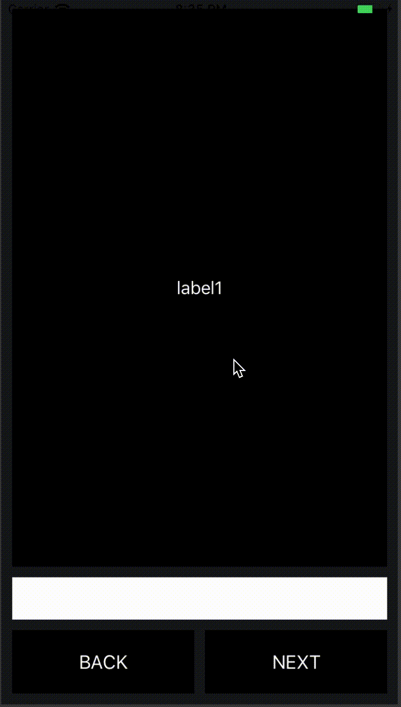

# ViewCycle

## Overview
ViewCycle provides the template for a very simple parent view that cycles between children views.

## Usage

Initializaiton:

```
// initialize parent view
let parentView = ParentView()

// create subviews
let label1 = UILabel()
label1.text = "label1"
let label2 = UILabel()
label2.text = "label2"

// add subviews
parentView.addChild(view: label1, tag: "label1")
parentView.addChild(view: label2, tag: "label2")
```

Example usage:
```
// activate view
parentView.switchToView(tag: "label1")

// switch to next view
parentView.next()

// switch to previous view
parentView.prev()
```

Carthage:
```
github "nathanmacfarlane/ViewCycle"
```

## Demo

